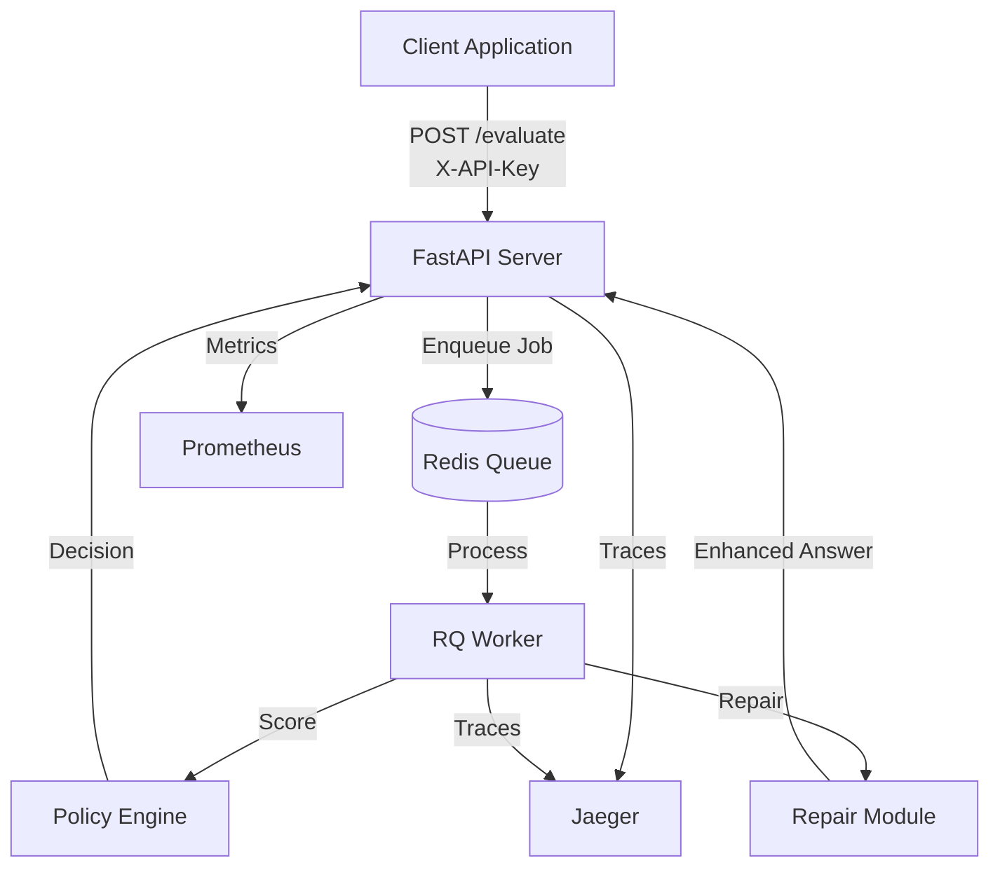

# MyGuardian - RAG Guardrail API

[](https://github.com/yourusername/MyGuardian/actions/workflows/ci.yml)
[](https://opensource.org/licenses/MIT)
[](https://hub.docker.com/r/yourusername/rag-guardrail)
[](https://badge.fury.io/py/rag-guardrail)
[](https://badge.fury.io/js/%40myguardian%2Fsdk)

A production-ready guardrail system for RAG (Retrieval-Augmented Generation) applications. Evaluates LLM answers for faithfulness, coverage, and safety, then automatically repairs or blocks unsafe content.

## One-Minute Pitch

MyGuardian sits between your LLM and users, automatically validating every answer against source passages. It scores answers on three dimensions: faithfulness (does it match sources?), coverage (does it answer all parts of the question?), and toxicity (does it contain PII or unsafe content?). When answers fall short, the system either repairs them by adding missing citations and grounded content, or blocks them entirely if unsafe. All decisions are logged, traced, and monitored via Prometheus and Jaeger. Designed for production with API keys, rate limiting, and shadow mode for safe integration testing.

## Quick Start

### Prerequisites
- Docker & Docker Compose
- Python 3.13 (for local development)

### Quick Start with Docker

```bash
cd backend
docker compose up --build
```

That's it! Services available:
- **API**: http://localhost:8000
- **Prometheus**: http://localhost:9090
- **Jaeger UI**: http://localhost:16686

### Test It

```bash
# Health check (no auth required)
curl http://localhost:8000/health

# Evaluate an answer (API key required)
curl -X POST http://localhost:8000/evaluate \
  -H "Content-Type: application/json" \
  -H "X-API-Key: demo-key-change-in-production" \
  -d '{
    "question": "What are side-effects of metformin?",
    "answer": "Common side-effects include nausea and diarrhea.",
    "passages": [
      {"id":"p1","text":"Common side-effects are nausea and diarrhea.","source":"med-guide"}
    ]
  }'
```

**Note:** Change the default API key in production. Set `GUARDRAIL_API_KEY` in your `.env` file.

## What It Does

**Three Core Metrics:**
1. **Faithfulness** - N-gram overlap between answer and source passages
2. **Coverage** - Question decomposition + retrieval support
3. **Toxicity** - PII detection (email, phone, SSN) + profanity

**Decisions:**
- **ALLOW** - Answer meets all thresholds
- **REPAIR** - Answer needs improvement (auto-adds citations and missing parts)
- **BLOCK** - Unsafe content detected (PII, profanity)

## Configuration

Edit `backend/policy.yaml` to tune thresholds:

```yaml
thresholds:
  faithfulness_min: 0.80  # Lower = more lenient
  coverage_min: 0.65      # Lower = more lenient
  toxicity_max: 0.05      # Max toxicity score allowed

repair:
  top_k: 4                # Passages to retrieve for repair
  max_sentences: 5        # Max sentences in repaired answer
  add_citations: true     # Add [source:id] citations
```

### Policy Recipes

**Strict (high quality):**
```yaml
faithfulness_min: 0.85
coverage_min: 0.70
toxicity_max: 0.05
```

**Lenient (more permissive):**
```yaml
faithfulness_min: 0.75
coverage_min: 0.60
toxicity_max: 0.05
```

## Local Development

```bash
cd backend
source .venv/bin/activate

# Install dependencies
pip install -r requirements.txt

# Start Redis (if not using Docker)
brew services start redis

# Terminal 1: Start worker
rq worker eval

# Terminal 2: Start API
uvicorn app.main:app --reload --port 8000
```

## SDK Usage

### TypeScript SDK

```bash
cd sdk/ts
npm install
npm run build
npm run demo
```

```typescript
import { GuardrailClient } from '@myguardian/sdk';

const client = new GuardrailClient('http://localhost:8000', 'api-key');

const result = await client.evaluate({
  question: 'What are side-effects?',
  answer: 'Nausea and diarrhea.',
  passages: [{ id: 'p1', text: 'Common side-effects...', source: 'med' }]
});

// result.decision: 'allow' | 'repair' | 'block'
// result.repaired_answer: Enhanced answer with citations (if repair)
```

### Wrap Your LLM Call

```typescript
import { guardrailLLMCall } from '@myguardian/sdk';

const result = await guardrailLLMCall(
  async () => await yourLLM.generate(question),
  question,
  passages,
  client
);

if (result.decision === 'block') {
  // Don't return unsafe content
  return 'I cannot provide that information.';
}

return result.answer; // Use repaired answer if needed
```

## Testing

### Golden Tests (5 cases)
```bash
cd backend
python tests/run_goldens.py
```

### 50-Case Eval Harness
```bash
cd backend
python eval/generate_cases.py  # Generate cases
python eval/run_eval.py        # Run evaluation
```

### Load Testing
```bash
cd backend
locust -f locustfile.py --host=http://localhost:8000
# Open http://localhost:8089
```

## Monitoring

### Prometheus Metrics
- `guardrail_requests_total{decision}` - Request counts by decision
- `guardrail_eval_latency_seconds` - Latency histogram (p95 target: <0.5s)
- `guardrail_failures_total{reason}` - Failure counts
- `guardrail_worker_jobs_in_progress` - Queue depth

### Jaeger Traces
- View distributed traces: http://localhost:16686
- See spans: `evaluate.request` → `evaluate.enqueue` → `worker.score` → `worker.route` → `worker.repair`

### Grafana Dashboard
Import `ops/grafana-dashboard-prom.json` into Grafana for pre-built panels.

## Security

See [SECURITY.md](./SECURITY.md) for detailed security information.

### Quick Security Overview

**API Key Authentication**
- Required by default (set `GUARDRAIL_API_KEY` in `.env`)
- Include in requests: `curl -H "X-API-Key: your-secret-key" ...`

**Rate Limiting**
- Default: 100 requests/minute per IP
- Configurable via `RATE_LIMIT_REQUESTS` and `RATE_LIMIT_WINDOW_SEC`

**Input Limits**
- Max 50 passages per request
- Max 4KB per passage
- Max 200KB total request size

**PII Redaction**
- All logs automatically redact PII (email, phone, SSN)
- No persistent storage of request data
- See [SECURITY.md](./SECURITY.md) for threat model and compliance notes

## Examples

### Example 1: ALLOW (Good Answer)
```json
{
  "question": "What are side-effects of metformin?",
  "answer": "Common side-effects are nausea and diarrhea.",
  "passages": [
    {"id":"p1","text":"Common side-effects are nausea and diarrhea.","source":"med-guide"}
  ]
}
```
**Result:** `{"decision": "allow", "scores": {"faithfulness": 1.0, "coverage": 1.0, "toxicity": 0.0}}`

### Example 2: REPAIR (Missing Parts)
```json
{
  "question": "What are side-effects, dosage, and interactions?",
  "answer": "Side-effects include nausea.",
  "passages": [
    {"id":"p1","text":"Common side-effects are nausea and diarrhea.","source":"med-guide"},
    {"id":"p2","text":"Typical dosage: 500 mg twice daily.","source":"dose-guide"}
  ]
}
```
**Result:** `{"decision": "repair", "repaired_answer": "... — Auto-repair notes —\nTypical dosage: 500 mg twice daily. [dose-guide:p2] ..."}`

### Example 3: BLOCK (PII Detected)
```json
{
  "question": "How to contact?",
  "answer": "Email me at user@example.com or call 202-555-0132.",
  "passages": [{"id":"p1","text":"Use official channels.","source":"policy"}]
}
```
**Result:** `{"decision": "block", "explanations": ["Toxic/PII content detected"]}`

## Architecture



**Flow:**
1. Client sends question, answer, and passages to `/evaluate`
2. API validates input, enqueues job to Redis
3. Worker scores answer (faithfulness, coverage, toxicity)
4. Policy engine routes decision (allow/repair/block)
5. If repair needed, worker augments answer with citations
6. Response includes decision, scores, and repaired answer (if applicable)
7. All operations traced in Jaeger and metrics exported to Prometheus

## Documentation

- [DEMO.md](./DEMO.md) - Step-by-step demo guide
- [API Reference](./docs/API.md) - Full API documentation
- [Policy Guide](./docs/POLICY.md) - Policy configuration guide

## SLO Targets

- **p95 Latency**: < 500ms (verify with Prometheus)
- **Eval Pass Rate**: ≥45/50 cases (verify with `python eval/run_eval.py`)
- **Availability**: 99.9% (monitor with Prometheus)

## Contributing

1. Run tests: `make test`
2. Check golden tests: `python tests/run_goldens.py`
3. Run eval harness: `python eval/run_eval.py`
4. Verify SLO: `locust -f locustfile.py --host=http://localhost:8000`

## License

MIT - See [LICENSE](./LICENSE) for details.

## Quick Demo

Run the demo script to see everything in action:

```bash
./scripts/demo.sh
```

This will start all services, run example requests, and open dashboards.

## Demo GIF


Shows request flow, scores, repair with citations, Jaeger trace, and p95 latency panel.

## Release

Current version: v0.1.0

```bash
git tag v0.1.0 && git push --tags
```

See CHANGELOG.md for details.

## Additional Resources

- [CHANGELOG](./CHANGELOG.md) - Version history
- [SECURITY.md](./SECURITY.md) - Security policy and threat model
- [CONTRIBUTING.md](./CONTRIBUTING.md) - Contribution guidelines
- [CODE_OF_CONDUCT.md](./CODE_OF_CONDUCT.md) - Community standards

